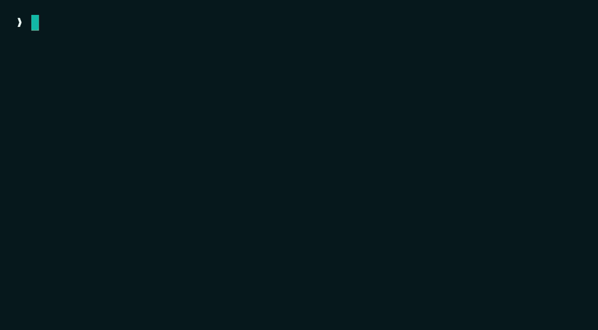

<p align="center">
  
</p>

<h1 align="center">VerisKit</h1>

<p align="center"><strong>The fastest way to prove your software works.</strong></p>

<p align="center">
  <a href="https://www.npmjs.com/package/veriskit"></a>
  
  
</p>

<p align="center">
  
</p>

<p align="center"><em>Change a file. VerisKit runs only the tests that reach it (2 of 28 here), then gives an honest verdict.</em></p>

---

VerisKit runs the test and quality tools your project already has (TypeScript, Vitest, Jest, `node:test`, ESLint, Biome), then turns their results into one honest verdict with a Markdown report you can paste into a pull request. There is no config to write and no new test framework to learn.

It answers the question a wall of green checkmarks leaves open: **is this change safe enough to trust?**

## Install

```bash
npx veriskit init
```

Or add it to a project:

```bash
npm install --save-dev veriskit
```

You install the package `veriskit`. The command it gives you is `veris`. (The bare name `veris` was already too close to another npm package.)

## Quickstart

```bash
veris init      # detect the stack, write .veris/config.json (idempotent)
veris verify    # run the configured checks, print a verdict, write a report
veris report    # print the latest report
```

Two more commands round out the basics. `veris doctor` prints a read-only capability report: what will run, what will be skipped, and why. `veris test` runs just the detected unit test runner with the same summarized output as `verify`.

## The verdict

`veris verify` runs your checks and prints one result. Here is a passing run:

```text
Veris

Project     veriskit
Risk        —

Checks
  ✓ types          1.2s
  ✓ unit           2.4s
  ✓ lint           0.6s

Result
  ✓ Verified

Report
  .veris/reports/verify-2026-07-10T09-04-52-076Z-1.md
```

The verdict has three states, not two:

| Verdict | Exit code | Meaning |
|---|---|---|
| `verified` | `0` | every configured check ran and passed |
| `failed` | `1` | at least one check failed |
| `partial` | `2` (`0` with `--partial-ok`) | no failures, but a check was skipped or its result is unknown |

A partial verdict is not a pass. A check can end up skipped when its runner is not installed, or when nothing in your change reaches it. VerisKit lists that check as skipped and lowers the verdict rather than folding it into "verified", because a folded skip hands CI confidence it did not earn. If your team wants partial runs to pass CI, opt in with `veris verify --partial-ok`.

VerisKit orchestrates the tools you already run. It shells out to `tsc`, Vitest, Jest, `node:test`, ESLint, and Biome, reads their exit codes and output, and reports one result. It does not run browser tests, and it does not ship its own test engine. Detection stays read-only, and `init` never overwrites an existing `.veris/config.json`.

## Developer loop

While you work, scope the checks to what you touched instead of running everything.

### `veris affected`

```bash
veris affected              # checks affected by working-tree changes vs HEAD
veris affected --base main  # checks affected by the diff against another ref (PR/CI)
```

`affected` reads which files changed (your working tree plus untracked files against `HEAD`, or against `--base <ref>` for a PR/CI diff) and maps each one to the check categories it can touch:

| Changed file | Checks run |
|---|---|
| test file | unit, lint |
| TypeScript file | types, lint, unit |
| JavaScript file | lint, unit |
| config (`tsconfig`, biome/eslint config, `package.json`, `veris.config.*`) | every available check |
| docs and assets (`.md`, images, `LICENSE`) | nothing |
| anything else unrecognized | every available check (a safe default) |

That table picks the check categories. Inside the `unit` category, `affected` goes further: it builds the same import graph that [`veris scan` and `veris plan`](#project-intelligence) use, then runs only the test files that transitively import your changed files.

The narrowing stays conservative. It runs the full unit suite whenever it cannot prove a smaller set is safe:

- a changed file matches a config or global pattern (`tsconfig*.json`, `package.json`, a `*.config.*` or `*.setup.*` file, biome/eslint config)
- a changed file is not a node in the import graph (it sits under an ignored directory like `node_modules` or `.veris`, or it is not a recognized code extension)
- no test file reaches any changed file, so the change has no tests to run
- the graph came from the relative-imports scanner rather than TypeScript, which can miss aliased imports

The output says when a run was narrowed, and when it ran in full and why:

```text
unit narrowed to 3 of 41 test file(s) via typescript graph
unit ran in full — global/config change (package.json)
```

An `affected` run never prints a bare "Verified". The terminal and report say "Affected checks passed" (or "failed", or "Affected: partial"), and every available-but-unaffected capability is listed as skipped with the reason `not affected by changes`. Touch only a doc and VerisKit prints "Nothing affected" and exits `0`, which is a no-op and not a verified result: no checks ran.

### `veris watch`

```bash
veris watch          # re-run affected checks as files change
veris watch --poll   # use mtime polling instead of native fs.watch
```

`watch` runs a full baseline over every available check once, then re-runs only the checks affected by whatever changed since the last tick. It uses Node's built-in recursive `fs.watch`, so it adds no dependency. On a platform where recursive `fs.watch` is unavailable, or a filesystem where native events are unreliable (some containers and network mounts), pass `--poll` to diff file mtimes on an interval instead.

Each tick reprints the full board and rebuilds the graph fresh, so narrowing reflects the file you just saved. A capability the latest change did not touch keeps its last real result, marked `⟳ cached`. A cached failure stays a failure (`✗`); VerisKit never hides it just because it did not rerun this tick. Press Ctrl-C to stop, and the watcher (or poll loop) closes cleanly with exit `0`.

## Project intelligence

`veris scan` and `veris plan` map your codebase's import graph and turn it into recommendations: what to test, where verification is thin, and which of your changes carry risk. Both are read-only analysis. Neither writes or generates any code.

### `veris scan`

```bash
veris scan
```

`scan` finds every source and test file, builds the import graph between them, and lists the source files with the most dependents that no test reaches. It writes the graph to `.veris/graph.json`, a derived cache rebuilt on every run.

`scan` always names the resolver that built the graph, because the two differ in accuracy:

- **`typescript`** runs when your project has a `tsconfig.json` and a `typescript` package that exposes the classic compiler API. VerisKit loads your project's own TypeScript at run time, so it adds no dependency, and it resolves imports the way `tsc` does: `tsconfig` path aliases, extension-mapped specifiers, index resolution.
- **`scanner`** is the fallback for a project with no TypeScript, no `tsconfig.json`, or a TypeScript 7.x native build that drops the classic compiler API. The scanner reads relative imports only. It follows `./foo` and `../bar/baz` but does not resolve `tsconfig` path aliases or computed dynamic imports, so on an alias-heavy project it can miss edges. `scan` labels the resolver it used, and VerisKit never treats a scanner graph as equal to the TypeScript one. This is also why graph-based narrowing in `affected` and `watch` runs the full suite in scanner mode.

### `veris plan`

```bash
veris plan               # recommendations from the current graph
veris plan --base main   # also factor in changes vs another ref
```

`plan` reads the graph and prioritizes:

- the highest-impact untested files to cover first (the most dependents, reached by no test)
- gaps in your setup, such as a missing linter or type-check
- with `--base <ref>`, the changed files that carry risk: high blast radius, and either untested or freshly changed

`plan` recommends. It never writes or generates test code. Generation is a later goal, not something VerisKit does today.

## Evidence

Every `veris verify` run leaves a record:

- A Markdown report at `.veris/reports/verify-<run-id>.md` with project and environment metadata, per-check status, timing, and summary, the verdict with its skipped list and reasons, and log references. Paste it into a PR.
- Raw per-check logs and run metadata under `.veris/runs/<run-id>/`.

Commit `.veris/config.json` and `.veris/.gitignore`. `veris init` writes `.veris/.gitignore` so `runs/`, `reports/`, `cache/`, and `graph.json` stay out of your history.

## What VerisKit does not do yet

VerisKit says what it cannot do as plainly as what it can:

- **No framework route or endpoint detection.** The graph understands imports, not that a file is an Express route or a Next.js page, so it flags an untested module but not an untested endpoint. Planned next.
- **No test generation.** `plan` tells you what to test. Writing the tests is a later release.
- **One project root.** A monorepo with several `tsconfig.json` files is not modeled yet. Resolution runs against the root project.
- **Scanner fallback on plain-JS or TS 7.x-native projects.** The accurate resolver needs the classic TypeScript compiler API. Without it you get the labeled, relative-imports-only graph described above, and no dependency is added to paper over the gap.

## Part of Baseframe Labs

VerisKit is one of four developer tools from [Baseframe Labs](https://www.baseframelabs.com), each answering a different question about your work:

- **[ProjScan](https://www.baseframelabs.com/apps/projscan)** asks: is the repository healthy?
- **[AgentLoopKit](https://www.baseframelabs.com/apps/agentloopkit)** asks: what should the agent do next?
- **[AgentFlight](https://www.baseframelabs.com/apps/agentflight)** asks: what did the agent actually do?
- **VerisKit** asks: can we trust the result?

Each works on its own. VerisKit needs none of the others to verify a change.

## Design

The design specs, locked decisions, and roadmap live in [`docs/superpowers/specs`](docs/superpowers/specs).

## License

MIT
